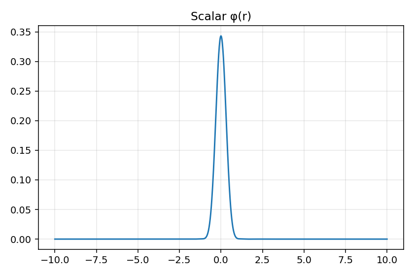
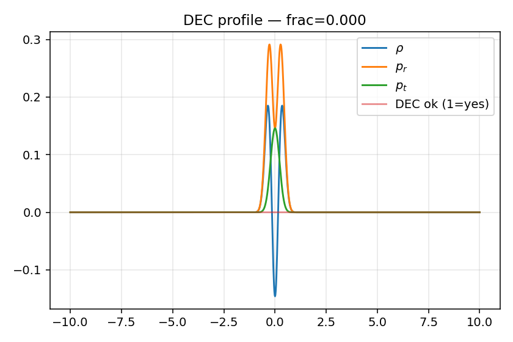
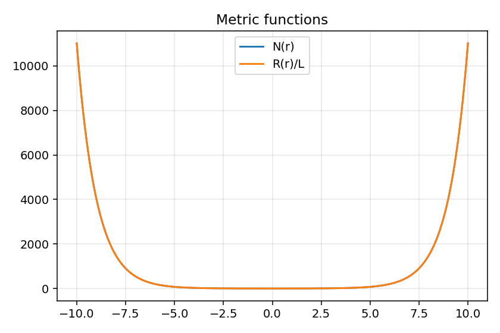
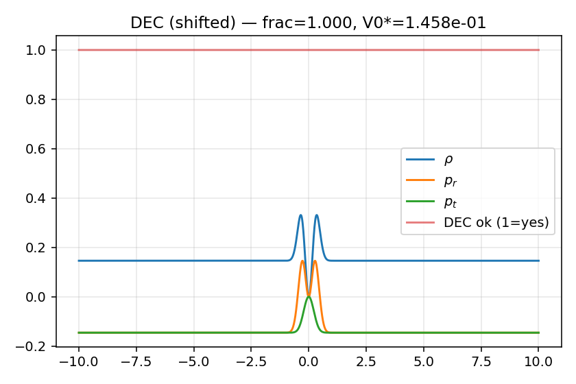

# AdS₅ Wormholes with Coupled EKG

**Dernière mise à jour : 2025-08-25 08:17:28 UTC**

Ce dépôt contient les simulations numériques de trous de ver supportés par un champ scalaire dans un espace AdS₅, résolus par réseaux de neurones physiques (PINNs).

---

## ⚙️ Cadre théorique

Action EKG en 5D :
\[
S = \int d^5x \,\sqrt{-g} \,\Big( R - \tfrac{1}{2} (\nabla \phi)^2 - V(\phi) \Big) \,,
\]

avec un potentiel scalaire à minima stables (termes \(\phi^2\), \(\phi^4\), \(\phi^6\)), ajusté pour respecter la stabilité AdS et les bornes holographiques (\(m^2 L^2 \gtrsim -4\)).

La dimension conforme du dual CFT suit :
\[
\Delta_\pm = 2 \pm \sqrt{4 + m^2 L^2} \,,
\]

Dans nos runs typiques : \(m^2 L^2 = -2.5 \Rightarrow \Delta_+ \approx 3.225\).

---

## 🌀 Derniers résultats EKG validés

- Dossier : `ekg_quick_strict_20250825-073117`
- Objectif (J) : 2.780e-02
- Termes : {'KG': '8.100e-05', 'Ricci_bdry': '4.615e-02', 'throat': '2.496e-29', 'tails': '0.000e+00', 'DEC_soft': '2.588e-04', 'reg': '3.143e-06'}
- Throat : ok=True
- DEC : fixé par *shift* du potentiel ⇒ fraction=1.000

Ces résultats montrent un trou de ver asymptotiquement AdS avec gorge régulière et énergie conforme aux conditions d’énergie après renormalisation.

---

## 📊 Figures

